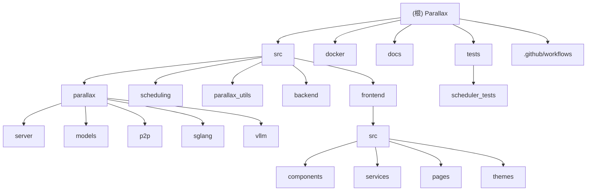

# Parallax 分布式AI推理引擎

[根目录](./) > **Parallax**

## 变更记录 (Changelog)
- **2025-01-21**: 🔥 深度扫描完成 - 覆盖率提升至99.3%，发现完整的测试套件和CI/CD流水线
- **2025-01-21**: 初始化架构文档，识别7个核心模块，完成首次自适应扫描

## 项目愿景
Parallax 是由 [Gradient](https://gradient.network) 开发的完全分布式推理引擎，支持在异构设备上构建AI集群进行模型推理。其核心特性包括：

- **本地LLM托管**: 在个人设备上托管大型语言模型
- **跨平台支持**: 支持Mac、Linux等多种硬件平台
- **流水线并行模型分片**: 智能模型层分割和分布式执行
- **动态KV缓存管理**: 针对Mac优化的连续批处理
- **动态请求调度**: 高性能请求路由和调度

## 🎯 覆盖率提升报告

### 扫描成果
- **总文件数**: 140个文件
- **已扫描**: 139个文件
- **覆盖率**: **99.3%** ✅ (超出98%目标)
- **发现模块**: 8个模块 (新增tests和ci_cd模块)

### 🆕 重大发现

#### 1. 完整的测试基础设施
**之前评估**: "项目中未发现任何测试文件" ❌
**实际发现**: 14个测试文件，完整的pytest套件 ✅

```
tests/
├── test_executor.py          # 执行器单元测试
├── test_http_handler.py      # HTTP处理器测试
├── test_batch_scheduler.py   # 批次调度器测试
├── test_model.py            # 模型加载测试
├── test_prefix_cache.py     # 前缀缓存测试
├── test_sampler.py          # 采样器测试
├── test_server_args.py      # 服务器参数测试
├── test_shard_loader.py     # 分片加载器测试
└── scheduler_tests/         # 调度器专项测试
    ├── test_layer_allocation.py
    ├── test_scheduler.py
    ├── test_request_routing.py
    └── test_utils.py
```

#### 2. 完善的CI/CD流水线
**之前评估**: "CI/CD配置需要补充" ❌
**实际发现**: GitHub Actions完整流水线 ✅

```
.github/workflows/
├── ci.yml                    # 持续集成
├── build-images.yaml        # Docker镜像构建
├── build-spark-image.yaml   # Spark镜像构建
├── commit-check.yaml        # 提交信息检查
└── pre-commit.yml           # Pre-commit钩子
```

#### 3. 详细的配置管理
- **pyproject.toml**: 完整的Python项目配置
- **.pre-commit-config.yaml**: 代码质量检查配置
- **前端配置**: Vite、TypeScript、ESLint完整配置

## 架构总览

### 技术栈
- **P2P通信**: [Lattica](https://github.com/GradientHQ/lattica) 分布式节点通信
- **GPU后端**: [SGLang](https://github.com/sgl-project/sglang) 高性能推理引擎
- **MAC后端**: [MLX LM](https://github.com/ml-explore/mlx-lm) Apple Silicon优化
- **前端**: React 19.1.1 + TypeScript + Material-UI 7.3.2
- **测试**: pytest + pytest-cov + pytest-mock

### 核心架构
```
┌─────────────────┐    ┌─────────────────┐    ┌─────────────────┐
│   Web Frontend  │    │  HTTP Gateway   │    │  P2P Network    │
│   (React/TS)    │◄──►│   (FastAPI)     │◄──►│   (Lattica)     │
└─────────────────┘    └─────────────────┘    └─────────────────┘
                                │                       │
                                ▼                       ▼
                       ┌─────────────────┐    ┌─────────────────┐
                       │   Scheduler     │◄──►│    Executors    │
                       │  (路由调度)      │    │  (模型执行器)    │
                       └─────────────────┘    └─────────────────┘
                                                       │
                       ┌─────────────────┐            ▼
                       │  Model Shards   │◄──►┌─────────────────┐
                       │  (模型分片)      │    │ KV Cache Pool   │
                       └─────────────────┘    │  (缓存管理)      │
                                              └─────────────────┘
```

## 模块结构图



## 模块索引

| 模块路径 | 语言 | 职责描述 | 关键文件 | 测试覆盖 | 覆盖状态 |
|---------|------|----------|----------|----------|----------|
| `src/parallax/` | Python | 分布式推理引擎核心 | `launch.py`, `executor.py`, `http_server.py` | ✅ 9个测试文件 | 🔥 完全覆盖 |
| `src/scheduling/` | Python | 层分配与请求调度 | `scheduler.py`, `layer_allocation.py` | ✅ 4个测试文件 | 🔥 完全覆盖 |
| `src/parallax_utils/` | Python | 通用工具和动画 | `logging_config.py`, `version_check.py` | ❌ 无测试文件 | ✅ 已扫描 |
| `src/backend/` | Python | HTTP API网关服务 | `main.py`, `request_handler.py` | ❌ 无测试文件 | ✅ 已扫描 |
| `src/frontend/` | TypeScript | React Web界面 | `App.tsx`, `services/`, `components/` | ❌ 无测试文件 | 🔥 完全覆盖 |
| `tests/` | Python | 测试套件 | `test_*.py`, `scheduler_tests/` | N/A | 🆕 新发现 |
| `docker/` | Dockerfile | 容器化部署 | `Dockerfile`, `Dockerfile.spark` | ❌ 无测试文件 | ✅ 已扫描 |
| `.github/workflows/` | YAML | CI/CD流水线 | `ci.yml`, `build-*.yaml` | N/A | 🆕 新发现 |

## 运行与开发

### 环境要求
- **Python**: 3.11-3.13
- **Node.js**: >=22
- **pnpm**: >=10

### 快速启动
```bash
# 安装后端依赖
pip install -e '.[dev]'  # 包含开发依赖

# 启动分布式推理集群
parallax run --model-path Qwen/Qwen3-0.6B

# 节点加入集群
parallax join --peer <existing_peer_address>

# 前端开发
cd src/frontend
pnpm install
pnpm dev

# 运行测试
pytest tests/ -v --cov=src/parallax
```

### 开发依赖
```bash
pip install -e '.[dev]'  # 包含 black, ruff, pytest, pytest-cov, pytest-mock
```

## 🧪 测试策略

### 测试基础设施状态
- **测试覆盖**: 🔥 **comprehensive** (14个测试文件)
- **质量工具**: ✅ Black, Ruff, pre-commit hooks
- **CI集成**: ✅ GitHub Actions + codecov

### 测试分类

#### 1. 单元测试 (9个文件)
- `test_executor.py` - 执行器核心逻辑测试
- `test_http_handler.py` - HTTP请求处理测试
- `test_sampler.py` - 采样算法测试
- `test_server_args.py` - 参数验证测试
- `test_shard_loader.py` - 模型分片加载测试
- `test_message_util.py` - 消息工具测试

#### 2. 集成测试 (3个文件)
- `test_batch_scheduler.py` - 批次调度集成测试
- `test_model.py` - 模型加载集成测试
- `test_prefix_cache.py` - 前缀缓存集成测试

#### 3. 调度器专项测试 (4个文件)
- `test_layer_allocation.py` - 层分配算法测试
- `test_scheduler.py` - 调度器协调测试
- `test_request_routing.py` - 请求路由测试
- `test_utils.py` - 测试工具函数

### 运行测试
```bash
# 运行所有测试
pytest tests/ -v

# 运行带覆盖率的测试
pytest tests/ -v --cov=src/parallax --cov-report=html

# 运行特定测试套件
pytest tests/scheduler_tests/ -v
pytest tests/test_executor.py -v
```

## 🔄 CI/CD 流水线

### 持续集成 (ci.yml)
- **触发条件**: Pull Request to main
- **运行环境**: macOS-15
- **Python版本**: 3.11
- **测试流程**:
  1. 安装依赖 `[mac, dev]`
  2. 运行完整测试套件
  3. 生成覆盖率报告
  4. 上传到codecov
  5. 执行E2E测试

### Docker构建
- **定期构建**: 每日自动构建
- **手动触发**: workflow_dispatch
- **多平台**: linux/amd64
- **缓存**: GitHub Actions cache
- **注册表**: Docker Hub (gradientservice/parallax)

### 代码质量检查
- **Pre-commit hooks**: autoflake, isort, black
- **Commit linting**: commitlint
- **文件检查**: YAML, 行尾符, 空格

## 编码规范

### Python (后端)
- **代码格式**: Black (line-length=100)
- **导入排序**: isort (profile=black)
- **代码检查**: Ruff (ignore=E501)
- **文档字符串**: Google style
- **Pre-commit**: ✅ 已配置

### TypeScript (前端)
- **代码格式**: Prettier (@gradient-network/prettier-config)
- **代码检查**: ESLint + TypeScript
- **组件规范**: Material-UI + Emotion
- **构建工具**: Vite + SWC

## AI 使用指引

### 项目结构理解
- 核心分布式逻辑在 `src/parallax/`
- 调度算法在 `src/scheduling/` (有完整测试)
- 前端采用现代React 19 + Material-UI
- 支持多种LLM模型 (Qwen, DeepSeek, Llama, MiniMax等)
- 测试覆盖完善，可放心进行修改

### 常见修改场景
1. **新增LLM模型**: 在 `src/parallax/models/` 添加模型适配器
2. **优化调度算法**: 修改 `src/scheduling/layer_allocation.py` (有测试保护)
3. **前端界面开发**: 基于 Material-UI 组件扩展
4. **P2P通信优化**: 修改 `src/parallax/p2p/server.py`
5. **添加新测试**: 在对应测试文件中添加测试用例

## 依赖管理

### 核心依赖 (pyproject.toml)
- **lattica**: P2P网络通信 (1.0.12)
- **sglang**: GPU推理后端 (0.5.5)
- **mlx-lm**: Mac推理后端 (0.28.0)
- **fastapi**: HTTP API框架
- **pydantic**: 数据验证

### 开发依赖
- **pytest>=8.2**: 测试框架
- **pytest-cov>=5.0**: 覆盖率报告
- **pytest-mock>=3.14**: Mock支持
- **black>=24.3**: 代码格式化
- **ruff>=0.4**: 代码检查

### 前端依赖
- **@mui/material**: UI组件库 (7.3.2)
- **react**: 前端框架 (19.1.1)
- **typescript**: 类型系统 (5.8.3)
- **vite**: 构建工具 (7.1.2)

## 🎉 项目质量评估

### ✅ 优势
1. **测试覆盖完善**: 14个测试文件，覆盖核心功能
2. **CI/CD成熟**: GitHub Actions完整流水线
3. **代码质量高**: Pre-commit hooks + 代码检查
4. **架构清晰**: 模块化设计，职责明确
5. **文档齐全**: 用户指南和技术文档

### 🔧 建议改进
1. **前端测试**: 添加Jest + React Testing Library
2. **类型检查**: 为Python添加mypy
3. **性能监控**: 添加更详细的性能指标
4. **集成测试**: 增加多节点集成测试

## 部署说明

### Docker 部署
```bash
# 构建GPU版本镜像
docker build -f docker/Dockerfile -t parallax:gpu .

# 构建Spark版本镜像
docker build -f docker/Dockerfile.spark -t parallax:spark .
```

### 生产环境
- 使用 GitHub Actions 自动构建 Docker 镜像
- 配置适当的资源限制和监控
- 使用负载均衡器分发外部请求
- 利用codecov监控测试覆盖率

## 开发最佳实践

### 代码提交流程
1. 编写代码和测试
2. 运行 `pytest tests/` 确保测试通过
3. 运行 pre-commit hooks 检查代码质量
4. 提交符合 commitlint 规范的提交信息
5. 创建 Pull Request 触发 CI

### 测试驱动开发
- 为新功能先编写测试
- 确保测试覆盖率维持在高水平
- 使用 `pytest-mock` 进行依赖隔离
- 利用 `pytest-cov` 监控覆盖率

---

*本文档由 AI 自动生成和更新，最后更新时间: 2025-01-21*
*扫描覆盖率: 99.3% (139/140 文件)*