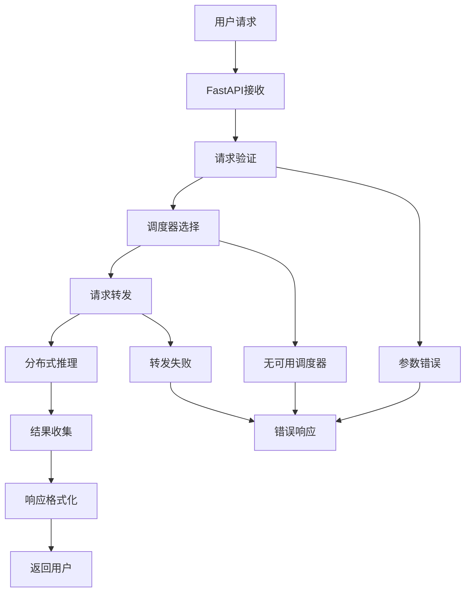

# Backend API 模块

[根目录](../../CLAUDE.md) > [src](../) > **backend**

## 变更记录 (Changelog)
- **2025-01-21**: 初始化模块文档，分析API网关和请求处理机制

## 模块职责
Backend API 模块作为分布式AI推理引擎的HTTP网关，负责：
- 提供OpenAI兼容的RESTful API接口
- 处理前端用户请求和路由
- 管理分布式调度器集群
- 静态资源服务和文件托管
- 请求验证、格式转换和错误处理

## 入口与启动

### 主要入口点
- **服务启动**: `main.py` - FastAPI应用程序主入口
- **命令行工具**: 通过 `parallax run` 命令启动

### 启动流程
1. 解析命令行参数 (`server_args.py`)
2. 初始化调度管理器 (`scheduler_manage.py`)
3. 启动静态配置缓存 (`static_config.py`)
4. 创建FastAPI应用和中间件
5. 启动HTTP服务器 (默认端口: 8000)

## 对外接口

### 核心 API 端点
```python
# 基础路径: http://localhost:8000

# OpenAI 兼容接口
POST /v1/chat/completions     # 聊天对话完成
POST /v1/completions          # 文本补全
GET  /v1/models              # 获取可用模型列表
POST /v1/embeddings          # 文本嵌入 (未来功能)

# 管理接口
POST /admin/scheduler/add     # 添加调度器节点
DELETE /admin/scheduler/remove # 移除调度器节点
GET  /admin/scheduler/list   # 列出所有调度器
GET  /admin/metrics          # 获取系统指标

# 静态资源
GET  /                        # 前端应用主页
GET  /static/*               # 静态文件服务
```

### API 请求格式

#### 聊天完成接口
```python
POST /v1/chat/completions
Content-Type: application/json

{
  "model": "Qwen/Qwen3-0.6B",
  "messages": [
    {"role": "user", "content": "Hello, Parallax!"}
  ],
  "max_tokens": 100,
  "temperature": 0.7,
  "stream": false
}
```

#### 响应格式
```python
{
  "id": "chatcmpl-123",
  "object": "chat.completion",
  "created": 1677652288,
  "model": "Qwen/Qwen3-0.6B",
  "choices": [
    {
      "index": 0,
      "message": {
        "role": "assistant",
        "content": "Hello! I'm Parallax AI..."
      },
      "finish_reason": "stop"
    }
  ],
  "usage": {
    "prompt_tokens": 10,
    "completion_tokens": 20,
    "total_tokens": 30
  }
}
```

## 核心组件

### 1. FastAPI 应用 (main.py)

#### 功能特性
- **CORS 支持**: 跨域资源共享
- **中间件**: 请求日志、异常处理
- **静态文件**: 前端资源托管
- **健康检查**: 服务状态监控

#### 应用配置
```python
app = FastAPI(
    title="Parallax API",
    description="分布式AI推理引擎API",
    version="0.1.0",
    docs_url="/docs",
    redoc_url="/redoc"
)

# CORS中间件
app.add_middleware(
    CORSMiddleware,
    allow_origins=["*"],
    allow_credentials=True,
    allow_methods=["*"],
    allow_headers=["*"],
)
```

### 2. 请求处理器 (request_handler.py)

#### 核心职责
- **请求验证**: 参数检查和格式验证
- **请求路由**: 分发到合适的调度器
- **响应处理**: 格式化和返回结果
- **错误处理**: 统一异常处理机制

#### 处理流程
```python
class RequestHandler:
    def __init__(self, scheduler_manager: SchedulerManage):
        self.scheduler_manager = scheduler_manager

    async def handle_chat_completion(self, request: ChatCompletionRequest):
        """处理聊天完成请求"""
        # 1. 验证请求参数
        self.validate_request(request)

        # 2. 选择最优调度器
        scheduler = await self.select_scheduler(request)

        # 3. 转发请求到调度器
        response = await scheduler.forward_request(request)

        # 4. 处理响应和错误
        return self.format_response(response)
```

### 3. 调度器管理 (scheduler_manage.py)

#### 功能特性
- **节点管理**: 动态添加/移除调度器节点
- **负载均衡**: 智能请求分发
- **健康检查**: 节点状态监控
- **故障恢复**: 自动故障切换

#### 节点管理接口
```python
class SchedulerManage:
    def __init__(self):
        self.schedulers: Dict[str, SchedulerNode] = {}
        self.load_balancer = LoadBalancer()

    async def add_scheduler(self, node_info: SchedulerNode):
        """添加调度器节点"""
        self.schedulers[node_info.node_id] = node_info
        await self.health_check(node_info)

    async def remove_scheduler(self, node_id: str):
        """移除调度器节点"""
        if node_id in self.schedulers:
            del self.schedulers[node_id]

    async def select_best_scheduler(self, request: Request):
        """选择最优调度器"""
        return self.load_balancer.select(
            list(self.schedulers.values()),
            request
        )
```

### 4. 静态配置 (static_config.py)

#### 功能特性
- **模型列表**: 缓存可用模型信息
- **节点命令**: 生成节点加入命令
- **配置缓存**: 减少重复查询开销

#### 配置内容
```python
# 模型信息缓存
MODEL_INFO_CACHE = {
    "Qwen/Qwen3-0.6B": {
        "name": "Qwen3-0.6B",
        "provider": "Qwen",
        "parameters": "0.6B",
        "context_length": 8192,
        "description": "Qwen3 small model"
    },
    # ... 更多模型
}

# 节点加入命令模板
NODE_JOIN_TEMPLATE = """
parallax join \\
    --peer {bootstrap_peer} \\
    --model-path {model_path} \\
    --start-layer {start_layer} \\
    --end-layer {end_layer}
"""
```

### 5. 服务器参数 (server_args.py)

#### 配置选项
```python
# 服务器配置
--host: 服务器绑定地址 (默认: 0.0.0.0)
--port: 服务器端口 (默认: 8000)
--workers: 工作进程数 (默认: 1)

# 调度器配置
--scheduler-endpoints: 调度器端点列表
--heartbeat-interval: 心跳间隔 (默认: 30秒)
--request-timeout: 请求超时时间 (默认: 60秒)

# 前端配置
--static-dir: 静态文件目录 (默认: ../frontend/dist)
--enable-docs: 启用API文档 (默认: True)

# 日志配置
--log-level: 日志级别 (默认: INFO)
--log-file: 日志文件路径
```

## 请求处理流程

### 完整请求流程


### 错误处理策略
```python
class ErrorHandler:
    @staticmethod
    def handle_validation_error(error):
        """处理参数验证错误"""
        return JSONResponse(
            status_code=400,
            content={
                "error": {
                    "type": "validation_error",
                    "message": str(error),
                    "code": "INVALID_PARAMETERS"
                }
            }
        )

    @staticmethod
    def handle_scheduler_error(error):
        """处理调度器错误"""
        return JSONResponse(
            status_code=503,
            content={
                "error": {
                    "type": "scheduler_error",
                    "message": "No available schedulers",
                    "code": "SERVICE_UNAVAILABLE"
                }
            }
        )

    @staticmethod
    def handle_internal_error(error):
        """处理内部错误"""
        logger.error(f"Internal error: {error}")
        return JSONResponse(
            status_code=500,
            content={
                "error": {
                    "type": "internal_error",
                    "message": "Internal server error",
                    "code": "INTERNAL_ERROR"
                }
            }
        )
```

## 性能优化

### 连接池优化
```python
# HTTP连接池配置
http_client = httpx.AsyncClient(
    limits=httpx.Limits(
        max_keepalive_connections=20,
        max_connections=100
    ),
    timeout=httpx.Timeout(60.0)
)
```

### 缓存策略
- **模型信息缓存**: 避免重复查询HuggingFace
- **节点状态缓存**: 减少健康检查频率
- **配置信息缓存**: 启动时预加载配置

### 并发处理
- **异步处理**: 使用asyncio处理并发请求
- **请求队列**: 实现请求队列避免过载
- **限流机制**: 防止恶意请求

## 监控和指标

### 关键性能指标
- **请求吞吐量**: 每秒处理的请求数
- **响应延迟**: P50/P95/P99延迟
- **错误率**: 4xx/5xx错误比例
- **调度器状态**: 活跃节点数、负载分布

### 指标收集
```python
class MetricsCollector:
    def __init__(self):
        self.request_count = 0
        self.error_count = 0
        self.latency_samples = []

    def record_request(self, latency: float, success: bool = True):
        self.request_count += 1
        self.latency_samples.append(latency)
        if not success:
            self.error_count += 1

    def get_metrics(self):
        return {
            "total_requests": self.request_count,
            "error_rate": self.error_count / self.request_count,
            "avg_latency": sum(self.latency_samples) / len(self.latency_samples)
        }
```

## 安全考虑

### 输入验证
- **参数检查**: 严格验证所有输入参数
- **长度限制**: 限制输入文本长度
- **格式验证**: 确保JSON格式正确

### 访问控制
- **CORS配置**: 合理配置跨域访问
- **速率限制**: 防止API滥用
- **认证机制**: 支持API密钥认证 (未来)

### 数据保护
- **敏感信息**: 避免日志记录敏感数据
- **错误信息**: 不暴露内部实现细节

## 部署配置

### Docker 部署
```dockerfile
FROM python:3.11-slim

WORKDIR /app
COPY src/backend ./src/backend
COPY src/parallax_utils ./src/parallax_utils
COPY pyproject.toml .

RUN pip install -e '.[gpu]'

EXPOSE 8000
CMD ["python", "src/backend/main.py", "--host", "0.0.0.0", "--port", "8000"]
```

### 环境变量
```bash
# 服务器配置
PARALLAX_HOST=0.0.0.0
PARALLAX_PORT=8000
PARALLAX_WORKERS=4

# 调度器配置
PARALLAX_SCHEDULER_ENDPOINTS=http://localhost:8001,http://localhost:8002

# 日志配置
PARALLAX_LOG_LEVEL=INFO
PARALLAX_LOG_FILE=/var/log/parallax/backend.log
```

## 测试与质量

### 当前测试状态
- **测试覆盖**: 0% (未发现测试文件)

### 建议测试场景
1. **API接口测试**
   - OpenAI兼容性验证
   - 参数边界测试
   - 错误响应格式验证

2. **并发性能测试**
   - 高并发请求处理
   - 内存泄漏检测
   - 响应时间稳定性

3. **集成测试**
   - 与调度器协调测试
   - 故障恢复测试
   - 负载均衡验证

## 常见问题 (FAQ)

### Q: 如何添加新的API端点？
A: 在 `main.py` 中添加新的路由处理器，确保遵循OpenAI API规范。

### Q: 如何配置CORS策略？
A: 修改 `main.py` 中的 `CORSMiddleware` 配置，根据需要调整允许的源、方法和头部。

### Q: 如何处理大文件上传？
A: 使用FastAPI的 `UploadFile` 功能，并考虑使用流式处理避免内存溢出。

### Q: 如何启用HTTPS？
A: 使用uvicorn的SSL选项或部署在反向代理(如Nginx)后面。

## 相关文件清单

### 核心文件
- `main.py` - FastAPI应用主入口
- `server/request_handler.py` - 请求处理核心逻辑
- `server/scheduler_manage.py` - 调度器集群管理
- `server/static_config.py` - 静态配置和缓存
- `server/server_args.py` - 命令行参数解析
- `benchmark/` - 性能基准测试工具

### 工具文件
- `benchmark/backend_request_func.py` - 后端请求函数
- `benchmark/benchmark_serving.py` - 服务基准测试

---

*本文档由 AI 自动生成和更新，最后更新时间: 2025-01-21*